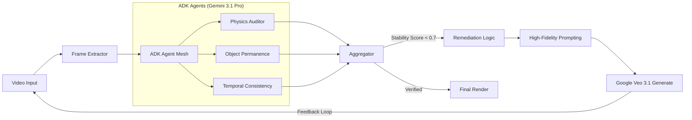

# Reality Check Engine 🚀

**Autonomous Video Verification Loop solving the "Continuity Gap" in Generative Media with Multi-Agent Logic.**


## 👁️ Vision

Foundation models generate pixels, not physics. Commercial video projects currently suffer from high "re-roll" costs due to semantic hallucinations—melting appendages, lighting flicker, and background morphing. 

**Reality Check Engine** is a closed-loop system where specialized auditors (**Gemini 3.1 Pro**) critique the artist (**Veo 3.1**). It translates visual failures into quantitative prompt corrections, automating the QC loop and fixing errors in-flight.

---

## 🏗️ System Architecture

The engine implements a multi-agent "Forensic Audit" mesh that evaluates video frames against physical and temporal ground truths.



---

## ✨ Key Features

- **Multi-Agent Forensic Audit**: Categorized evaluation (Physics, Lighting, Morphology) using Gemini 3.1 Pro.
- **Continuity Mode (Similarity Fix)**: Uses first, middle, and end frames as anchor assets to ensure regenerated videos stick to the original camera angle and subject.
- **Ephemeral Security**: API keys are session-based (`sessionStorage`) and auto-expire after 1 hour, ensuring no sensitive data is saved permanently.
- **Real-time Visualization**: Interactive dashboard showing coherence scores and time-coded alerts.

---

## 🛠️ Local Setup

Follow these steps to deploy the auditor on your machine:

1. **Clone the Repository**
   ```bash
   git clone https://github.com/moshem-a/genai-video-eval.git
   cd genai-video-eval
   ```

2. **Install Dependencies**
   ```bash
   npm install
   ```

3. **Configure Environment**
   Create a `.env` file based on `.env.example`. 
   *Note: In production, the system requires each user to provide their own Gemini API Key via the UI for session-based security.*

4. **Launch Development Server**
   ```bash
   npm run dev
   ```
   The server will be available at `localhost:5173`.

5. **Deploy to Cloud Run (Optional)**
   ```bash
   ./deploy_gcp.sh
   ```

---

## 🛡️ Technology Stack

- **Core**: React + TypeScript + Vite
- **AI Models**: Gemini 3.1 Pro (Audit), Google Veo 3.1 (Regeneration)
- **Styling**: TailwindCSS + Framer Motion
- **Deployment**: Google Cloud Run (Docker-based)

---

## 👨‍💻 Author
Created with  by **Moshe Mazuz**.
