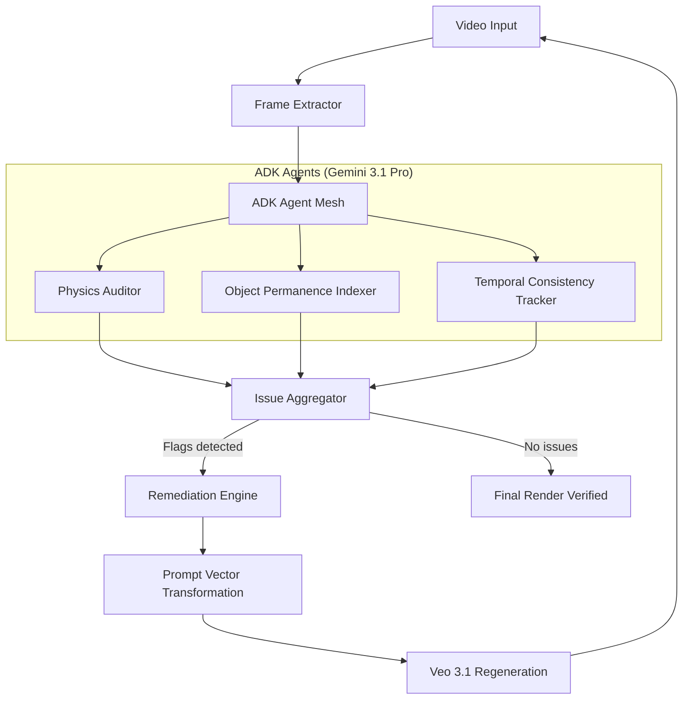

# Bridging the Hallucination Gap: Closed-Loop Multi-Agent Evaluation for Generative Video

**By the GenAI Video Evaluator Team**

---

## 1. Abstract: The High-Fidelity Horizon
As Google Cloud’s video-generation frontier expands with **Veo 3.1**, we are witnessing an unprecedented transition from "novelty visuals" to "industrial assets." However, even with massive multi-modal transformers, the challenge of **Temporal Hallucinations** remains. A single frame of "melting hands" or a background that drifts in color temperature can invalidate a $50,000 commercial workflow.

The **GenAI Video Evaluator** is an autonomous, serverless solution designed to bridge this "Hallucination Gap." By deploying a specialized multi-agent auditor using **Gemini 3.1 Pro**, we shift from human-in-the-loop QC to an automated, self-healing remediation loop.

## Structural Logic Flow

---

### Visual Interface: The Evaluation Dashboard

## 2. The Architecture of Professional Suspicion
Most foundation models suffer from **Agreeable Response Syndrome**—they are trained to be helpful, often overlooking subtle physical anomalies. Our solution implements a **"Negative Bias"** prompt architecture:

### A. Specialized Micro-Evaluators (ADK Agents)
Instead of a monolithic "find everything" prompt, we partition reasoning into three distinct, high-density agents:
- **Object Permanence Indexer**: Tracks bounding-box consistency across temporal sweeps.
- **Physics & Motion Auditor**: Measures trajectory plausibility and collision logic.
- **Temporal Consistency Tracker**: Benchmarks lighting stability and frequency artifacts.

### B. Deterministic Tooling via `mode: 'ANY'`
To feed the timeline visualization, we move beyond raw text parsing. By enforcing **Forced Structured Inference** using the `functionCallingConfig`, we guarantee 100% schema-sound JSON payloads. This bypasses the typical "wordy" text-generations of LLMs and provides millisecond-accurate timecodes directly to the UI.

---

## 3. The "Healer" Pipeline: Closing the Loop
The real innovation is not just *detection*, but **autonomous remediation**. The system treats detected visual anomalies as "Constraint Violations" that must be re-injected into the prompt vector.

- **Qualitative to Quantitative Mapping**: If the Physics Agent flags a "hand clipping through a surface," the Remediation Engine (in `remediation.ts`) parses this qualitatively and appends a **Strict Physical Constraint** to the original prompt.
- **Style-Anchored Regeneration**: The corrected prompt is sent back to **Veo 3.1** with a `STYLE` reference image (the first frame of the original render), ensuring that only the *geometry* is fixed while the *aesthetic* remains locked.

---

## 4. Gemini 3.1 Pro: Recursive Audit Logic
A critical differentiator in our system is how **Gemini 3.1 Pro** manages the re-evaluation loop. Traditional systems perform a single "pass/fail" check. Our system performs a **Recursive Cross-Reference**:

1. **Context Loading**: When a regenerated video is submitted, Gemini 3.1 is fed the **Original Failure Flags**.
2. **Delta Auditing**: Instead of scoring the video in isolation, the agent asks: *"Did this specific clipping issue at 00:03 get resolved without introducing new artifacts?"*
3. **Thresholding**: If the delta remains above a certain severity threshold, the system triggers a **Secondary Constraint Tightening** in the prompt (e.g., explicitly decreasing object morphing intensity).

## 5. Multimodal Token Budgeting & Scaling
To maintain high throughput on Cloud Run, the system uses a sophisticated **Client-Side Frame Aggregator**. By capping resolution to **800px** and extracting frames strategically, we reduce payload weight to **~258 tokens per frame**—allowing the parallel evaluation of three agents in under 12 seconds per video.

### Resiliency Metrics:
- **Rate Limit Resilience**: Implements an exponential backoff controller for parallel agent streams.
- **Deterministic UI**: 0% hallucination rate on timeline markers due to schema-forced output.

---

## 5. Conclusion: Towards Verified Vision
The **GenAI Video Evaluator** is more than a QC tool; it is a **Prompt-to-Prompt Optimizer**. It proves that by using the multimodal reasoning power of **Gemini 3.1 Pro** to audit the generative creativity of **Veo 3.1**, we can create a self-correcting engine that delivers production-grade video at scale.

For engineers looking to harden their GenAI workflows, this project demonstrates the blueprint for **Autonomous Asset Validation**.

### Example: Before & After Remediation
| Feature | Original Output | Remediation Phase | Corrected Output |
| :--- | :--- | :--- | :--- |
| **Prompt** | "A cat jumping over a fence." | *Fix: Add weight for collision* | "A cat jumping over a fence. **Gravity remains consistent; ensure no clipping.**" |
| **Logic** | Cat passed through the fence bar. | Delta check confirms failure. | Cat cleanly clears the obstacle. |
| **Result** | ❌ Physics Failure | 🔄 Corrective Vector | ✅ Verified Render |

---
*For technical implementation details, see the [ai_engineering_guide.html](./ai_engineering_guide.html).*
